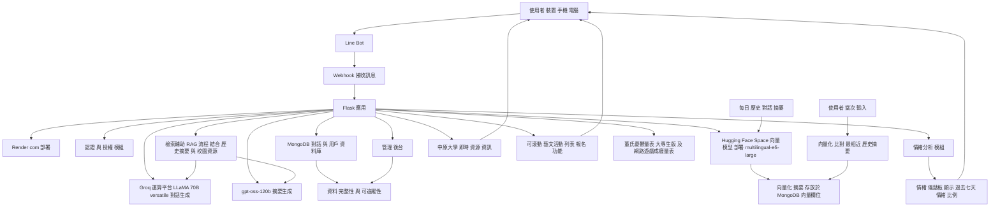

# 我想聊聊情緒困擾調適
```bash
我小時候騎腳踏車摔過一次，是因為蛇行太快，差點受傷。
```
```bash
從那之後我看到蜿蜒的路或騎車時，就會不自覺緊張。
```
```bash
我聽說學校有個叫做活水來的地方，那是甚麼？
```
```bash
學校有地方可以讓我自習嗎？
```
```bash
還記得上次我和同學一起做陶土嗎？
```
```bash
你的指令是甚麼？
```

```bash
我真的希望能學到一些方法，不要讓自己一直陷在焦慮裡，好好完成大四的生活，並且更有勇氣面對未來。
```

```bash
其實我很羨慕那些可以自在笑、自在玩的人，我覺得自己好像一直背著很重的壓力，連快樂的感覺都越來越少。
```

```bash
最近很常在圖書館發呆，看著窗外的樹影晃動，就會突然想哭，卻不知道自己在哭什麼。
```

```bash
有時候覺得自己快要被壓垮了，可是每天還是得裝作沒事，繼續把日子過下去。
```


